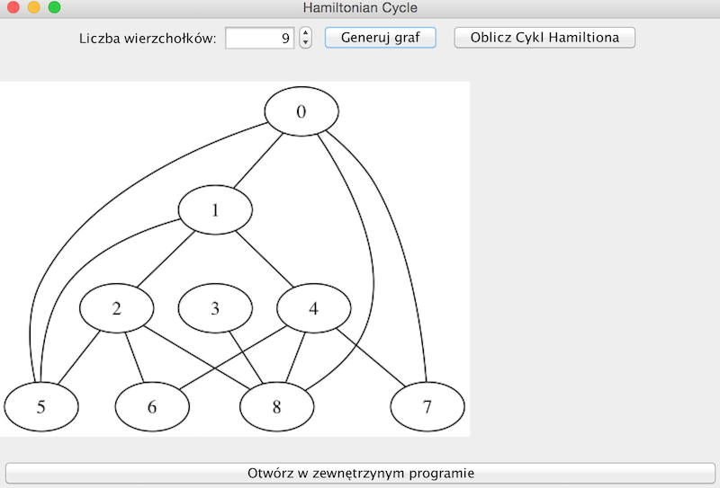
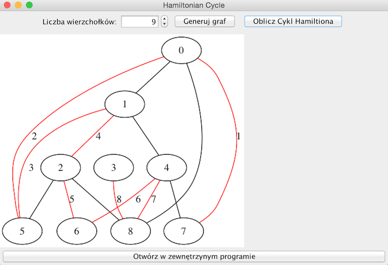

## Prerequisties
- Installed Graphviz/dot. ([Windows] (http://www.graphviz.org/Download_windows.php)
 [Mac OS X] (http://www.graphviz.org/Download_macos.php)
 [Linux/Ubuntu] (http://www.graphviz.org/Download_linux_ubuntu.php))
 
- If you don't have graphviz installed you can copy/paste content of SOURCE.dot file to [this site](http://sandbox.kidstrythisathome.com/erdos/).
- maven 

## How to run it
- Figure it out by yourself

# Screens

## Drawing with DOT
[Dot guide](http://www.graphviz.org/pdf/dotguide.pdf)
